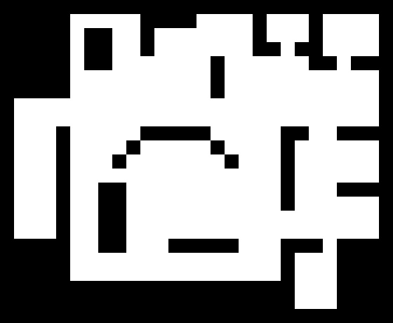
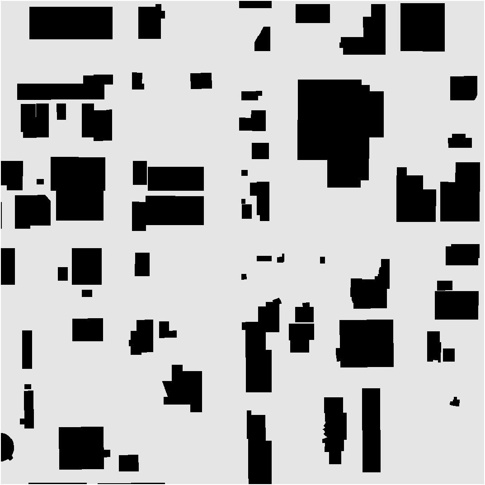

# TMSTC-Star
## A Turn-minimizing Algorithm For Multi-robot Coverage Path Planning  

## Description
It partitions the map with a minimum number of bricks as spanning tree’s branches, greedily connects bricks to form a complete spanning tree and then applys the greedy strategy of MSTC* to find the optimal equilibrium division on the topological loops around the spanning tree, thus averaging the weights of each robot coverage path. In addition, it incorporates turn cost into the weights of the paths.

## 1. Prerequisites
Ubuntu and ROS Ubuntu 16.04. ROS Kinetic. Or Ubuntu and ROS Ubuntu 18.04. Something went wrong with robot pose publisher in ROS Noetic, not recommended.

Make sure your gazebo has all models especially when you are using ROS kinetic, otherwise gazebo may stuck at the beginning of simulation.
```
    cd ~/.gazebo && mkdir models
    cd ~/.gazebo/models
    git clone https://github.com/osrf/gazebo_models
```

## 2. Build package on ROS
```
    cd ~/catkin_ws/src
    git clone https://github.com/CourierLo/TMSTC-Star.git
    cd ../
    catkin_make
    source ~/catkin_ws/devel/setup.bash
```

## 3. Run programs
```
    roslaunch MSTC_Star_update main.launch
    rosrun MSTC_Star_update realTf_broadcaster
    rosrun MSTC_Star_update map_transformer
```

## 4. Parameters Explanation (main.launch)
`/robot_number`: the number of robots that gazebo simulates

`/allocate_method`: "DARP" or "MSTC"

`/MST_shape`: "DFS_HORIZONTAL", "DFS_VERTICAL", "KRUSKAL", "ACO", "HEURISTIC", "RECT_DIV" or "DINIC"

`/coverAndReturn`: let robots return to its depot or not, "true" or "false"

`/data_file_path`: results' data path, results contain planning time and coverage time(min and max)

`/map_scale`: the number of image pixels for a map grid's width and height, the smaller you set, the bigger the coverage map will be

`/coverage_action`: if you don't want robots cover at all so as to see the planning paths, set "false"
    
If sets "MSTC" and "DINIC" at the same time, the planner will perform TMSTC*. Change main.launch to add more robots. If you want to use another map, remember to modify image path in `map/map.yaml` as well.
## 5. Demos
mCPP on various environments:

 
 
 
 

 
 
     


## P.S
This code was initially designed to verify some ideas and was not carefully structured. I will refactor the code with some useful tools such as *clang*, *gtest* and *asan* when I have time.